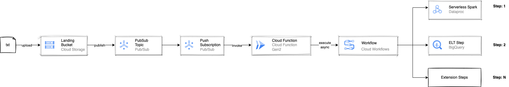

# cloud-workflows-demo

This repository contains demo data-pipelines orchestrated by Google Cloud Workflows.

**Pipelines:**
* **Word Count (event driven processing)**

  * Text files arrives to a GCS bucket
  * Object notification is sent to PubSub
  * PubSub push-subscription triggers a Cloud Function
  * Cloud Function triggers a Cloud Workflow with the necessary arguments
  * Cloud Workflow encapsulates all steps to process this file and execute them:
    * Submits a serverless Spark job to Dataproc. The job count the words and store the results per file in a BigQuery table
    * Pool the job status and wait to report success or failure
    * If the Spark job succeeds, it triggers a SQL step to BigQuery to re-construct an aggreagte table

All resources are defined and deployed by a Terraform module.

# Terraform Deployment

#### Set Variables
```shell
export PROJECT_ID=
export COMPUTE_REGION=
export ACCOUNT=user@company.com
export BUCKET=${PROJECT_ID}-terraform
export TF_SA=terraform
```

Create (or activate) a gcloud account for that project
```shell
export CONFIG=workflows-sandbox
gcloud config configurations create $CONFIG

gcloud config set project $PROJECT_ID
gcloud config set account $ACCOUNT
gcloud config set compute/region $COMPUTE_REGION
```

Auth gcloud
```
gcloud auth login --project $PROJECT_ID
gcloud auth application-default login --project $PROJECT_ID
```

#### Prepare Terraform State Bucket

```shell
gsutil mb -p $PROJECT_ID -l $COMPUTE_REGION -b on gs://$BUCKET
```

#### Prepare Terraform Service Account

Terraform needs to run with a service account to deploy DLP resources. User accounts are not enough.

```shell
./scripts/prepare_terraform_service_account.sh
```

#### Enable GCP APIs

```shell
./scripts/enable_gcp_apis.sh
```


#### Terraform Variables Configuration

The solution is deployed by Terraform and thus all configurations are done
on the Terraform side.

##### Create a Terraform .tfvars file

Create a new .tfvars file and override the variables in the below sections. You can use the example
tfavrs files as a base [example-variables](terraform/example-variables.tfvars).

```shell
export VARS=variables.tfvars
```

##### Configure Project Variables

Most required variables have default values defined in [variables.tf](terraform/variables.tf).
One can use the defaults or overwrite them in the newly created .tfvars.

Both ways, one must set the below variables:

```yaml
project = "<GCP project ID to deploy solution to (equals to $PROJECT_ID) >"
compute_region = "<GCP region to deploy compute resources e.g. cloud run, iam, etc (equals to $COMPUTE_REGION)>"
data_region = "<GCP region to deploy data resources (buckets, datasets, tag templates, etc> (equals to $DATA_REGION)"
```

##### Configure Terraform Service Account

Terraform needs to run with a service account to deploy DLP resources. User accounts are not enough.

This service account name is defined in the "Setup Environment Variables" step and created
in the "Prepare Terraform Service Account" step.
Use the full email of the created account.
```yaml
terraform_service_account = "${TF_SA}@${PROJECT_ID}.iam.gserviceaccount.com"
```

#### Deploy Terraform

Terraform needs to run with a service account to deploy DLP resources. User accounts are not enough.

```shell
./scripts/deploy_terraform.sh
```

#### Enable Google Private Access

* This repo is using the default VPC of the target project
* To use Dataproc with private IPs one must enable Google Private Access on the subnetwork. This is done via 
```shell
gcloud compute networks subnets update <SUBNETWORK> \
--region=<REGION> \
--enable-private-ip-google-access
```
* On the customer project, a shared VPC is expected and the subnetwork has to enable Google Private Access


# Running Sample

To execute the wordcount pipeline, upload a text file to the `data` bucket created by Terraform

```shell
gsutil cp gs://pub/shakespeare/rose.txt gs://<project>-data-wordcount/landing/rose.txt
```

The wordcount Cloud Workflow will populate BigQuery tables `sandbox.word_count_output` and `sandbox.word_count_aggregate`

Run the below query to track the progress of file processing steps across the different GCP components:
```roomsql
SELECT * FROM monitoring.v_global_tracker
```
